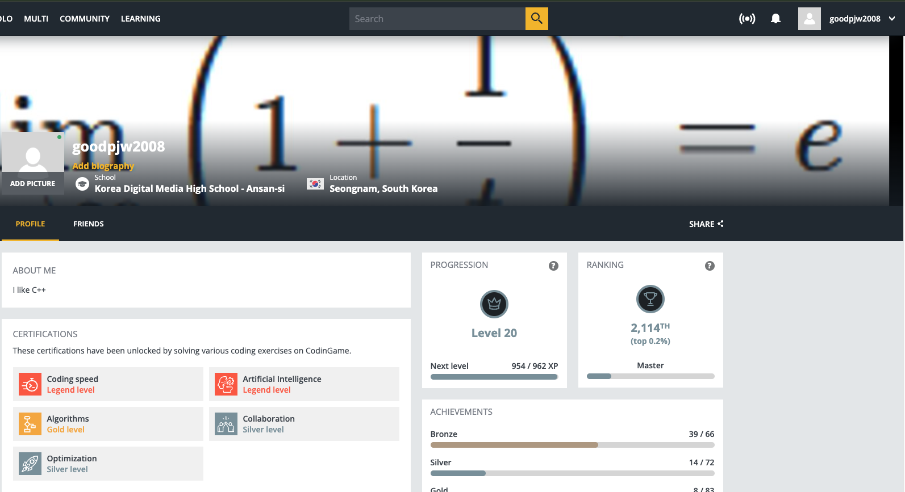
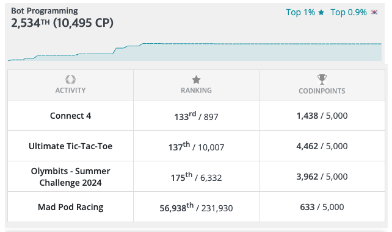
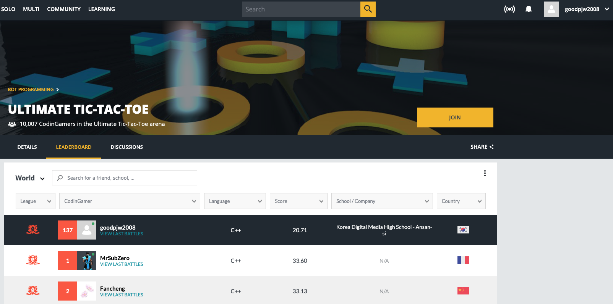
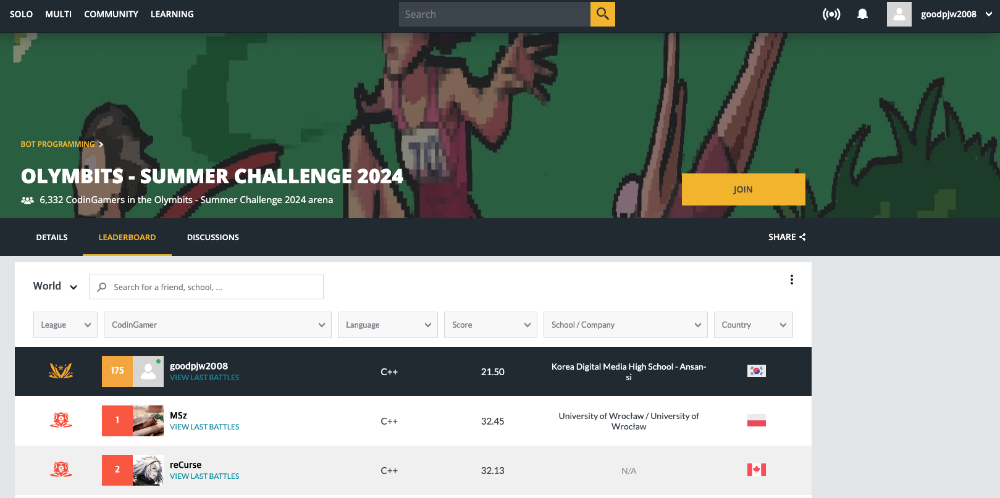
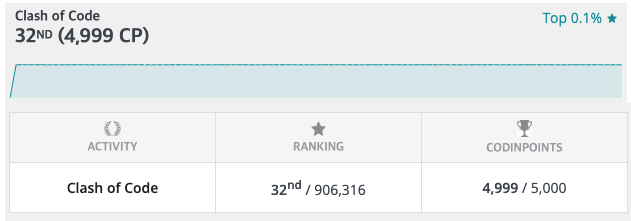

# AI 봇 및 코딩게임 관련 AI 활동 보고서

> **CodinGame 글로벌 플랫폼 활동 정리** — 전 세계 개발자 200만 명 이상이 참여하는 글로벌 코딩·AI Bot 경진 플랫폼에서의 AI 활동 기록

| 항목 | 내용 |
| --- | --- |
| **제출자** | 박진우 (goodpjw2008@gmail.com) |
| **플랫폼** | [CodinGame](https://www.codingame.com/) |
| **활동 범위** | AI Bot Programming / Algorithm (2개 트랙) |
| **활동 기간** | 2024 ~ 2025 |
| **작성일** | 2026-05-13 |

---

## 핵심 성과 (★)



CodinGame 공식 Certification 시스템에서 **Artificial Intelligence 분야 Legend 등급(최상위)** 과 **Coding Speed 분야 Legend 등급(최상위)** 을 동시에 획득했고, 전체 계정 글로벌 랭킹 **2,114위 (Top 0.2%, Master Tier)** 를 기록 중입니다.

| 분야 | 글로벌 순위 | 비율 | 한국 비율 | 핵심 기술 |
| --- | --- | --- | --- | --- |
| **AI Bot Programming** | 2,534위 / 약 25만+ | Top 1% | **Top 0.9% (한국)** | MCTS, Expectimax, Minimax + α-β 가지치기 |
| **Algorithm (Clash of Code)** | **32위 / 906,316명** | **Top 0.1%** | — | 실시간 알고리즘 문제 해결 |

### 분야별 공식 Certification 등급

| 분야 | 등급 | 비고 |
| --- | --- | --- |
| Artificial Intelligence | ★ **Legend** | 최상위 등급 — AI 분야 만점 인증 |
| Coding Speed | ★ **Legend** | 최상위 등급 — 코딩 속도 만점 인증 |

> `Legend`는 CodinGame Certification 시스템의 **최상위** 등급입니다.

---

## 1. AI Bot Programming — 자작 AI 봇 대결 트랙 (★ 핵심)



CodinGame의 Bot Programming 트랙은 참가자가 직접 작성한 AI 봇끼리 게임으로 대결시키는 방식입니다. 게임의 룰만 주어지고, **어떻게 의사결정을 할지는 100% 참가자가 직접 설계**해야 합니다. 응답 시간 제한도 빠듯해서 (첫 턴 1초, 이후 매 턴 100ms) **탐색 효율과 알고리즘 최적화가 절대적으로 중요**합니다.

- 글로벌 누적 **2,534위 (10,495 CP)** — 전 세계 상위 1%
- 한국 내 **상위 0.9%**
- 다수 종목에서 **한국 1위** 차지

### 종목별 결과

| 종목 | 글로벌 순위 | 한국 순위 | AI 핵심 기술 |
| --- | --- | --- | --- |
| **Ultimate Tic-Tac-Toe** | 137위 / 10,007명 (Top 1.4%) | **한국 1위** | MCTS + Minimax 종료국면 탐색 |
| **Olymbits — Summer Challenge 2024** | 175위 / 6,332명 (Top 2.8%) | **한국 1위** | Expectimax + α-β + Softmax 상대 모델링 |
| Connect 4 | 133위 / 897명 | — | 게임 트리 탐색 |
| Mad Pod Racing | 56,938위 | — | (입문 단계 봇) |

---

### 1.1 Ultimate Tic-Tac-Toe — 🇰🇷 한국 1위



- **공식 리더보드**: <https://www.codingame.com/multiplayer/bot-programming/tic-tac-toe/leaderboard>
- **소스코드**: [source_ai_bot_ulimate_tictactoe/ultimate_tictactoe.cpp](source_ai_bot_ulimate_tictactoe/ultimate_tictactoe.cpp) (334 줄)
- **핵심**: MCTS + Minimax 하이브리드 — 100ms 안에 수만 회 시뮬레이션 + 종반부 미니맥스 검증

> 상세 분석은 [[별첨1] AI_Bot_Ultimate_TicTacToe_개발 활동 보고서.pdf]([별첨1]%20AI_Bot_Ultimate_TicTacToe_개발%20활동%20보고서.pdf)를 참고해주세요.

---

### 1.2 Olymbits — Summer Challenge 2024 — 🇰🇷 한국 1위



CodinGame의 글로벌 챌린지인 Summer Challenge 2024에서 제 계정 `goodpjw2008`이 한국 부문 1위를 차지했습니다.

- **공식 리더보드**: <https://www.codingame.com/multiplayer/bot-programming/summer-challenge-2024-olymbits/leaderboard>
- **소스코드**: [source_ai_bot_olymbits/olymbits.cpp](source_ai_bot_olymbits/olymbits.cpp) (588 줄)
- **핵심**: Expectimax + α-β + Sigmoid 상대 모델링 — 4 종목 동시 진행 환경에서 깊이 12 탐색

> 상세 분석은 [[별첨2] AI_Bot_Olymbits_개발 활동 보고서.pdf]([별첨2]%20AI_Bot_Olymbits_개발%20활동%20보고서.pdf)를 참고해주세요.

---

### 1.3 두 봇이 보여주는 AI 역량 종합 매핑

| AI 핵심 역량 | Ultimate Tic-Tac-Toe | Olymbits |
| --- | --- | --- |
| **트리 탐색 알고리즘 설계** | MCTS 4단계 표준 구현 | Expectimax + α-β 깊이 12 |
| **탐색-활용 균형(Exploration-Exploitation)** | UCB1, C=0.4 튜닝 | 빔 폭 동적 조정 |
| **확률적 상대 모델링** | (MCTS 시뮬레이션 자체가 확률적) | Sigmoid/Softmax 정책 |
| **다목적 최적화** | (단일목적) | Log-기댓값 변환, 4종목 동시 최적화 |
| **도메인 지식 임베딩** | 비트보드 + 사전계산 룩업 | 게임별 DP/거리/선형결합 평가함수 |
| **알고리즘 하이브리드화** | MCTS + Minimax 종반 보완 | Expectimax + Beam Search + 휴리스틱 |
| **실시간 추론 최적화 (100ms 제약)** | 트리 재사용·GC, 룩업, SIMD, splitmix64 | Undo 스택, 무브 오더링, SIMD |
| **하이퍼파라미터 튜닝** | 탐색 상수 C=0.4, midlim=40, middep=2 | 게임별 온도 T=3/150/8/20, 깊이 12 |

---

### 1.4 학습 기반 AI(딥러닝)와의 관계

본 봇들은 딥러닝 기반이 아니라 **고전 AI 탐색(Search-based AI)** 계열입니다. 그런데 알파고와 같은 현대 강화학습 AI의 핵심 골격을 공유하고 있다는 점에서 의미가 있다고 생각합니다.

| 본 봇 기법 | 대응되는 현대 AI 시스템 |
| --- | --- |
| MCTS + UCB1 | AlphaGo, AlphaZero의 의사결정 코어 |
| Sigmoid 기반 상대 모델링 | 강화학습 Soft Actor-Critic의 Boltzmann 정책 |
| Log-기댓값 최대화 | Policy Gradient의 log-likelihood objective |
| 빔 서치 | LLM 디코딩 / Seq2Seq 추론 |
| 휴리스틱 평가함수 | 알파고 Value Network의 hand-crafted 전조 |
| 시간 예산 기반 적응형 추론 | LLM의 추론 시간 스케일링(Inference-time scaling) |

신경망 학습 없이도 AlphaZero가 의존하는 동일한 알고리즘 골격(MCTS + 평가함수)을 직접 설계·구현해본 셈이고, 학습 기반 모델로 확장할 때도 이 토대 위에서 신경망을 평가함수·정책 네트워크로 자연스럽게 끼워 넣을 수 있습니다.

---

## 2. Algorithm 트랙 (Clash of Code) — 🌍 세계 Top 0.1%



- 글로벌 **32위 / 906,316명 (Top 0.0035%)** — 세계 0.1% 이내
- **CodinPoints 4,999 / 5,000** — 만점에 1점 모자란 사실상 만점
- **Clash of Code**: 짧은 시간(15분 이내) 안에 알고리즘 문제를 푸는 실시간 경쟁 모드
- 90만 명 규모의 참가자 풀에서 32위는 사실상 최상위권
- 평가 척도: **정확성, 속도, 코드 간결성**

이 트랙은 AI 봇 자체가 아니라, AI/ML 시스템을 구현할 때 꼭 필요한 **알고리즘 사고력과 구현 속도**를 보여주는 지표입니다. AI 엔지니어링의 기본기를 검증해주는 기록입니다.

> 상세 분석은 [[별첨3] Algorithm_Clash_of_Code_활동 보고서.pdf]([별첨3]%20Algorithm_Clash_of_Code_활동%20보고서.pdf)를 참고해주세요.

---

## 3. 종합 평가

### 3.1 AI 역량 측정 결과 매핑

| 역량 영역 | 측정 근거 |
| --- | --- |
| **AI 의사결정 시스템 설계** | Ultimate Tic-Tac-Toe(MCTS+Minimax 하이브리드), Olymbits(Expectimax+상대 모델링) — 모두 한국 1위 |
| **탐색 알고리즘 깊이 있는 이해** | MCTS, Minimax, α-β 가지치기, Expectimax를 게임 특성에 맞게 선택·하이브리드화 |
| **확률 모델링/베이지안 사고** | 시그모이드 기반 상대 행동 확률 추정, 메달 기대값 로그 변환 |
| **실시간 추론 성능 최적화** | 100ms 내 수만 회 시뮬레이션 — 비트보드, SIMD, 룩업테이블, 트리 재활용 |
| **알고리즘 기본기** | Clash of Code 글로벌 32위 (Top 0.1%) |

### 3.2 활용된 AI 관련 기법

1. **상태 모델링** (비트보드 / Undo 스택)
2. **탐색 알고리즘 설계** (MCTS / Expectimax + α-β)
3. **확률·통계적 의사결정** (UCB1 / Sigmoid 정책)
4. **다목적 최적화** (Log-기댓값 변환)
5. **도메인 지식 임베딩** (게임별 휴리스틱·DP)
6. **하이퍼파라미터 튜닝** (탐색상수·온도·깊이)
7. **실시간 추론 최적화** (시간예산·SIMD·트리재활용)

---

## 4. 프로젝트 구조

```
ai_bot_codinggame/
├── README.md                                              # 본 문서
├── AI봇 및 코딩게임 관련 AI 활동 보고서.pdf                # 메인 보고서
├── [별첨1] AI_Bot_Ultimate_TicTacToe_개발 활동 보고서.pdf  # Ultimate Tic-Tac-Toe 상세
├── [별첨2] AI_Bot_Olymbits_개발 활동 보고서.pdf            # Olymbits 상세
├── [별첨3] Algorithm_Clash_of_Code_활동 보고서.pdf         # Clash of Code 상세
├── source_ai_bot_ulimate_tictactoe/
│   └── ultimate_tictactoe.cpp                             # Ultimate Tic-Tac-Toe 봇 소스 (334 줄)
├── source_ai_bot_olymbits/
│   └── olymbits.cpp                                       # Olymbits 봇 소스 (588 줄)
└── images/                                                # 리더보드·프로필 캡처
    ├── 00_main_legend_level.png
    ├── 01_bot_programming.png
    ├── 01_01_bot_ultimate_tictactoe.png
    ├── 01_02_bot_olymbits.png
    ├── 02_algorithm.png
    └── 03_optimization.png
```

---

## 5. 첨부 보고서

| 파일 | 내용 |
| --- | --- |
| [[별첨1] AI_Bot_Ultimate_TicTacToe_개발 활동 보고서.pdf]([별첨1]%20AI_Bot_Ultimate_TicTacToe_개발%20활동%20보고서.pdf) | Ultimate Tic-Tac-Toe AI Bot 단독 개발 활동 보고서 |
| [[별첨2] AI_Bot_Olymbits_개발 활동 보고서.pdf]([별첨2]%20AI_Bot_Olymbits_개발%20활동%20보고서.pdf) | Olymbits AI Bot 단독 개발 활동 보고서 |
| [[별첨3] Algorithm_Clash_of_Code_활동 보고서.pdf]([별첨3]%20Algorithm_Clash_of_Code_활동%20보고서.pdf) | Algorithm 트랙(Clash of Code) 단독 활동 보고서 |

---

## 6. Contact

- **Author**: 박진우
- **Email**: goodpjw2008@gmail.com
- **CodinGame ID**: [goodpjw2008](https://www.codingame.com/profile/goodpjw2008)
